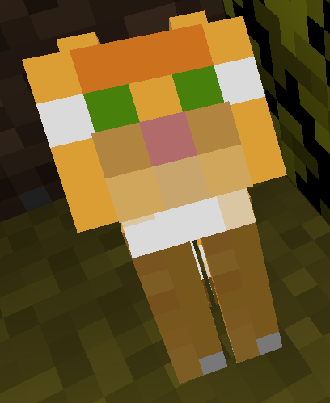

# Pet Graves (alpha)

Alpha-quality code implementing Pet Graves for Fabric and Minecraft 1.15.2.

* Current feature set
    * If a pet dies, it spawns a gravestone.
    * That gravestone... looks kind of like a gravestone. 
    * That's it.

* Planned features
    * Implement serialization to store entity data in gravestone upon death.
    * Add "wand of life" tool that can bring pets back to life.
    * Some item textures would probably be nice.

This mod is open-sourced under a permissive license! You can use it in any modpack you like, and if you're a nerd, you can even copy and modify the code! ^w^ See the [LICENSE file](LICENSE) for more details.

Special credit to [B0undarybreaker (Meredith Espinosa)](https://github.com/Boundarybreaker) for her [Fabric starter template](https://github.com/CottonMC/FabricStarter) and her willingness to put up with my incessent questions.
